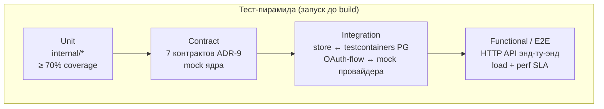

# Требования к программной архитектуре CLIProxyNew

> **Статус:** Принят.
> **Назначение:** принципы, качественные атрибуты с метриками, ограничения и
> стандарты, на основе которых проектируется и валидируется архитектура.
> Это **не** функциональные требования (см. [requirements.md](requirements.md)
> R1–R12) и **не** ADR (см. [adr/](adr/)) — это системные -ilities и conventions.
>
> **Связанные:** [requirements.md](requirements.md), [architecture.md](architecture.md),
> [database-schema.md](database-schema.md), ADR-1..10.

---

## 1. Архитектурные принципы (design principles)

Основа, на которой принимаются все решения.

| Принцип | Формулировка | Связь |
|---------|--------------|------|
| **Слоистость** | `cmd → httpapi → services → store`. Запрет обратных зависимостей: HTTP-слой не вызывается из store, store не знает про HTTP. | — |
| **Изоляция ядра** | Ядро CLIProxyAPI — внешняя go-зависимость. Бизнес-слой не дублирует upstream-специфику (refresh, transport, реестр моделей как источник истины). | ADR-1 |
| **Contract-based расширение** | Расширение ядра — только через 7 контрактов ADR-9. Никаких fork/patch ядра. | ADR-9 |
| **SDK compatibility** | Ядро обновляется через публичный `sdk/*` API, pinned версию и compatibility gate; новый major требует ADR. | R12 |
| **Stateless-first** | Всё состояние в Postgres. In-memory кэш — только за интерфейсом (`internal/cache`), с заделом под Redis. | R6.1, ADR-8 |
| **Interface segregation** | Кэш, шифрование, репозитории — за интерфейсами. Реализация заменяема (Postgres ↔ ClickHouse, in-process ↔ Redis). | ADR-5, ADR-8 |
| **Configuration over code** | Режим identity source, группы LDAP и allow-list моделей — в конфиге; system proxy задается стандартным окружением процесса. | R1, R9.A.6, R10 |
| **YAGNI** | Не реализуем квоты/rate-limit, UI, плагины на первой версии. Каждое новое требование проходит через «нужно ли это сейчас». | Роль репо |
| **Idempotency** | Mutating-операции (OAuth Complete, Store.Save, audit log) безопасны при retry/duplicate. | R9.A.1 |

## 2. Качественные атрибуты (quality attributes) — с метриками

Измеримые цели, на которые проектируем. Метрики валидируются perf- и
load-тестами; regression по ним блокирует release (см. §4).

### 2.1 Производительность (performance)

SLA на накладные расходы бизнес-слоя (без upstream-вызова):

| Метрика | Цель | Где измеряется |
|---------|------|----------------|
| Inference-запрос, overhead бизнес-слоя | **≤ 5 мс (p95)**: auth + selector + analytics | trace span на inference |
| `access.Provider.Authenticate` (cache hit) | **≤ 2 мс (p95)**: lookup + bcrypt | trace span |
| `access.Provider.Authenticate` (cache miss) | **≤ 15 мс (p95)**: DB lookup + bcrypt | trace span |
| `Selector.Pick` | **≤ 3 мс (p95)**: model_overrides + выбор | trace span |
| `Store.Save` (после refresh) | **≤ 10 мс (p95)**: AES-GCM + UPSERT | metric histogram |
| `usage.Plugin.HandleUsage` | **async, не блокирует ответ**; bulk INSERT batched | metric queue depth |
| In-process cache hit ratio (session/API-key) | **≥ 95%** в steady state | metric counter |

### 2.2 Масштабируемость (scalability)

| Метрика | Цель |
|---------|------|
| Линейное масштабирование | до N реплик без shared-state (цель — линейный growth throughput) |
| Postgres — единственный bottleneck | партиционирование `usage_events` по дню + материализованные агрегаты |
| In-process кэш | TTL 5–15с; eventual consistency revocation ≤ TTL (приемлемо, R2.4) |
| Целевая нагрузка (для load-тестов) | **TBD** — зафиксировать в load-test-plan перед v1 |

### 2.3 Надёжность/доступность (reliability/availability)

| Метрика | Цель |
|---------|------|
| Graceful shutdown | drain in-flight запросов; `Service.Shutdown(ctx)` ≤ 30с |
| Multi-replica | ≥ 2 реплики; отказ одной не снижает сервис |
| Leader election failover | при падении лидера перевод ≤ 10с (advisory lock release + acquire) |
| DB connection pool | `pgxpool` с bounded size; no connection leak; `ctx` timeout на запросы |

### 2.4 Безопасность (security)

| Метрика/требование | Цель |
|--------------------|------|
| At-rest шифрование | bcrypt cost 12 (API-keys) + AES-256-GCM (upstream-credentials), key-versioning (R5) |
| In-transit | HTTPS только; LDAP over TLS (`ldaps://`) |
| Secrets | только env/k8s Secret; **никогда** в config.yaml, логах, метриках, трейсах |
| Debug identity | static source только в development/test; production startup запрещает его, credentials из env |
| Revocation latency | eventual consistency ≤ TTL кэша (5–15с) |
| Audit completeness | 100% mutating admin-действий в `admin_audit_log` (append-only) |
| No secret leakage | CI-проверка: grep секретов в логах/тестах; no `fmt.Println` credential |
| SDK updateability | Patch/minor SDK проходит build, contract/race/integration gates; новый major — ADR и миграционный план | R12 |

### 2.5 Observability

| Требование | Реализация |
|------------|-----------|
| Структурные логи | `slog` JSON; поля `request_id`, `user_id`, `provider`, `model`, `auth_id` |
| Метрики | Prometheus `/metrics`: request_count/latency histogram, refresh_success/failure, cache_hit/miss, db_pool_stats, usage_queue_depth |
| Трейсы | OpenTelemetry; span на inference + access.Provider + Selector + Execute; trace-context прокидывается |
| Health | `/healthz` (liveness = процесс жив), `/readyz` (readiness = DB ping) |
| Alerting | метрики с SLO: error-rate > 1%, p95 latency > SLA × 2, refresh_failure_rate > 5% |

### 2.6 Maintainability / Testability

| Требование | Цель |
|------------|------|
| Тесты на 7 контрактов ADR-9 | обязательные unit-тесты (mock ядра через интерфейсы) |
| Coverage бизнес-логики (`internal/*`) | **≥ 70%** (см. §4 — CI gate) |
| sqlc-генерация | не правится руками; `*.sql` → `sqlc generate` |
| Документация | каждый пакет — godoc; каждое спорное решение — ADR |

## 3. Ограничения (constraints)

Что мы **не делаем** — отрицательные требования, чтобы избежать scope creep.

| ❌ Не делаем | Почему |
|--------------|--------|
| Не forkаем/патчим ядро | ADR-1 — внешняя зависимость |
| Не реализуем квоты/rate-limit | Отложено (роль репо) |
| Не пишем плагины | Используем контракты ADR-9, не plugin host |
| Не используем Redis на v1 | ADR-8 — Postgres достаточно |
| Не делаем UI на v1 | R9.G — только REST API |
| Не храним пароли/LDAP bind в БД | R5 — только env |
| Не используем `Manager.Login` для HTTP | R9.A.1 — блокирующий, своя реализация |
| Не используем `Execute` для health-check | R9.A.5 — тратит квоту |
| Не используем `SessionAffinity` | R6.1 — конфликтует с stateless multi-replica |
| Не используем inline `cfg.APIKeys` | R2 — `SetExclusiveProvider("db-apikey")` |

## 4. Тестирование (testing pyramid)

Полная пирамида тестов; запуск **до build/package** — CI гейт.

| Уровень | Что покрывает | Инструменты | CI gate |
|---------|---------------|-------------|---------|
| **Unit** | бизнес-логика `internal/*` (auth/identity, auth/ldap, selector, security, usage, oauth, testing) | `testing`, `testify` | coverage ≥ 70% |
| **Contract** | 7 контрактов ADR-9 (Store, Selector, Hook, usage.Plugin, access.Provider, WatcherFactory, ModelRegistryHook) — mock ядра через интерфейсы | `testify/mock`, `gomock` | 100% контрактов покрыты |
| **SDK compatibility** | Обновление `CLIProxyAPI/v7`: публичные `sdk/*` вызовы, `internal/sdkcontract` и wiring | `go test -race ./internal/sdkcontract`, `go vet`, `go build` | merge запрещён при incompatibility |
| **Integration** | store ↔ реальная PG (testcontainers), static/LDAP source isolation, OAuth-flow ↔ mock провайдера, миграции `up`/`down` | `testcontainers-go`, `dockertest` | миграции идемпотентны |
| **Functional / E2E** | HTTP API энд-ту-энд (login → API-key → inference → analytics), load-тесты по SLA §2.1 | `httptest`, `vegeta`/`k6` | SLA-метрики не regress'иты |

**Порядок запуска (CI pipeline):**
1. `go vet ./...` + `gofmt -l` (static checks)
2. `go test -short -race ./...` (unit + contract)
3. `go test -run Integration ./...` (testcontainers — медленно)
4. coverage report + gate (≥ 70%)
5. `go build ./...` (только если 1–4 прошли)
6. `docker build` + push (только если build прошёл)
7. Для изменения версии SDK: `sdk-reference.md`, contract-тесты ADR-9 и
   integration suite до merge.

## 5. Стандарты и conventions

| Область | Стандарт |
|---------|---------|
| **Импорты** | Канонический путь `github.com/ilyast91/CLIProxyNew/...` |
| **Стиль** | `gofmt`/`goimports`; табы для `.go`, пробелы для `.yaml`/`.md` (`.editorconfig`) |
| **Комментарии** | Русский (документация), godoc для экспортируемого |
| **Именование** | snake_case для таблиц/колонок БД, camelCase для Go-идентификаторов, kebab-case для конфиг-ключей |
| **Обработка ошибок** | `error` с контекстом (`fmt.Errorf("...: %w", err)`); sentinel-errors через `errors.Is`; no `panic` в бизнес-логике |
| **Логирование** | structured `slog`; уровни Debug/Info/Warn/Error; **никогда** не логируем секреты |
| **Контекст** | `context.Context` первым параметром во всех публичных методах; cancellation уважируется; для стриминга principal копируется в Record, не из ctx |
| **Миграции** | `golang-migrate`, `YYYYMMDDHHMMSS_<name>.up.sql` + `.down.sql`; идемпотентные |
| **API-контракт** | OpenAPI 3.1; spec-first (`openapi.yaml`); генерация типов из спеки; ручные правки кода не допускаются (R11) |
| **SDK-зависимость** | Только публичные `sdk/*` импорты; версия pinned в `go.mod`; обновление проходит R12 compatibility gate |

## 6. Cross-cutting concerns

| Concern | Где реализован | Принцип |
|---------|---------------|---------|
| **Конфигурация** | `internal/config` | config.yaml (ConfigMap) + env-секреты (Secret); env-override (12-factor) |
| **Обработка ошибок** | на уровне handlers | Единый error-response (OpenAI-compatible); mapped HTTP status |
| **Observability** | middleware + плагины | Сквозная инструментация; trace context через все слои |
| **Security** | `internal/security`, `internal/access`, identity middleware | Шифрование за интерфейсом; проверка статуса и identity source на каждый запрос |
| **Multi-tenancy** | плоская (R4) | `user_id` во всех таблицах; role guard в middleware |
| **API-контракт (Swagger)** | `openapi.yaml` spec-first | OpenAPI 3.1; код генерируется из спеки; CI lint + drift-check (R11) |
| **SDK compatibility** | `go.mod`, `docs/sdk-reference.md`, 7 контрактов ADR-9 | Обновляемая внешняя зависимость без fork/internal-импортов (R12) |

## 7. Эволюция архитектуры

**ADR immutable + supersede.** Принцип: ADR не правится; при изменении решения
старый помечается `Status: Deprecated (superseded by ADR-N)`, пишется новый
с обоснованием, почему старое решение больше неактуально. Сохраняет историю.

### Процесс изменения архитектуры

1. Проблема/новое требование, не вписывающееся в текущие ADR → новый ADR.
2. ADR содержит: контекст, рассматриваемые варианты, решение, последствия.
3. Если новый ADR supersede'ит старый — cross-link в обоих.
4. Принципы (§1) и quality attributes (§2) могут пересматриваться только через
   явное решение с обновлением метрик (если меняется SLA — documented regression
   или новый target).

## История
- 2026-07-12 — сформулированы требования к архитектуре: принципы, quality
  attributes с жёсткими SLA-метриками, полная тест-пирамида с CI gate
  (запуск до build), ADR immutable + supersede.
- 2026-07-12 — **R11 OpenAPI:** добавлен cross-cutting concern «API-контракт
  (Swagger)» — spec-first, OpenAPI 3.1, генерация кода из спецификации,
  CI lint + drift-check (R11).
- 2026-07-14 — **R1.5 static identity source:** configuration-over-code
  расширен явным режимом identity source; добавлены production gate,
  source-isolation и тестовые требования для static/LDAP credentials.
- 2026-07-14 — **R12 SDK compatibility:** закреплены публичная граница
  `sdk/*`, compatibility gate для обновлений v7 и ADR-процесс для major.
