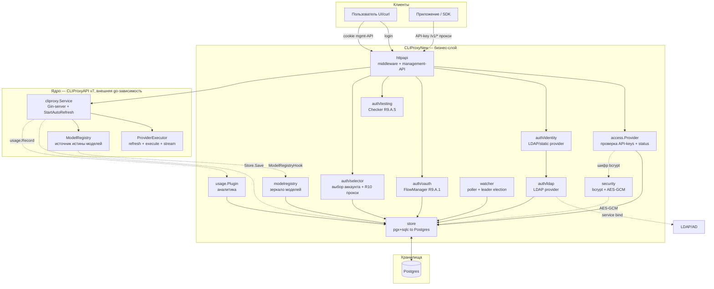
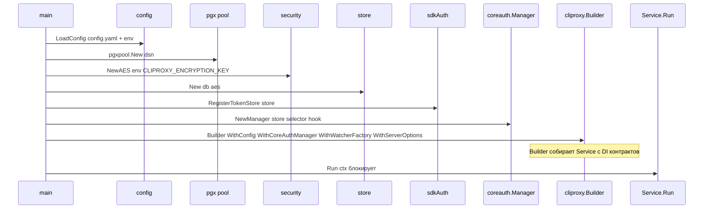
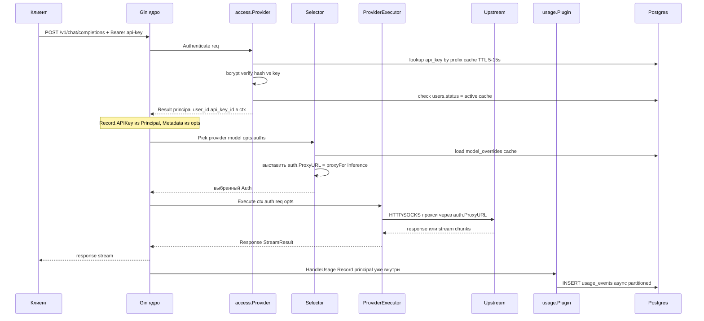
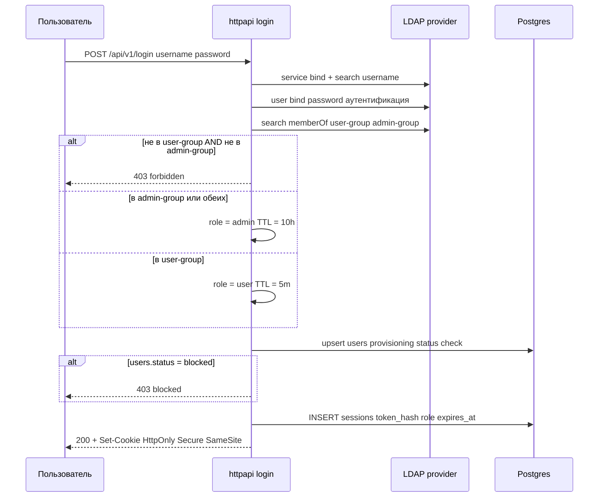
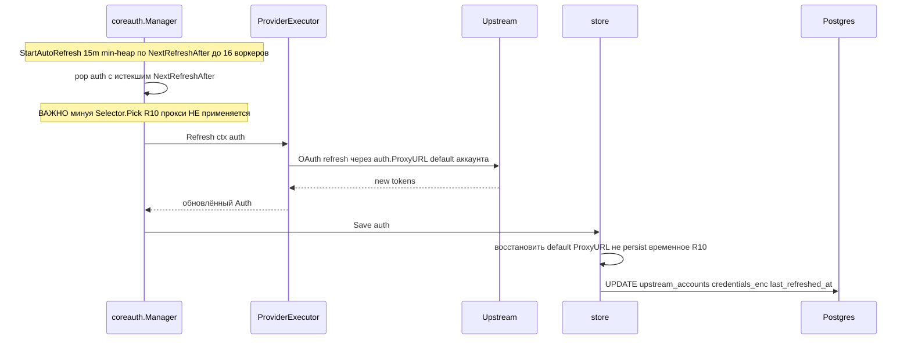
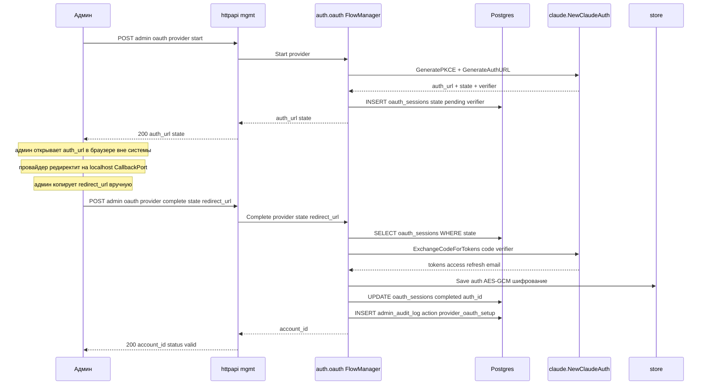
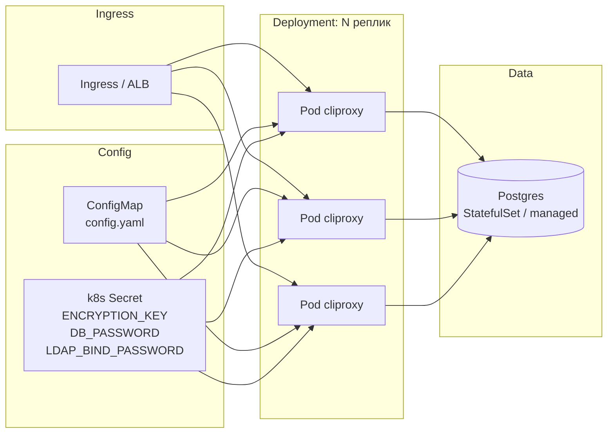

# Архитектура CLIProxyNew

> **Статус:** Дизайн.
> **Связанные:** [requirements.md](requirements.md) (R1–R12), [ADR-9](adr/ADR-9-sdk-contracts.md), [ADR-10](adr/ADR-10-per-call-type-proxy.md), [database-schema.md](database-schema.md).

## 1. Обзор

`CLIProxyNew` — бизнес-обвязка над upstream relay-движком
`github.com/router-for-me/CLIProxyAPI/v7` (далее «ядро»). Бизнес-слой
реализует **7 контрактов расширения** ядра (ADR-9) и добавляет: identity auth
(LDAP в production, static в development/test), аналитику, management-API,
per-call-type прокси, observability, multi-replica в k8s.



### Развязка ответственности

| Делает ядро | Делает бизнес-слой (этот репо) |
|-------------|-------------------------------|
| Refresh-протоколы OAuth провайдеров | `coreauth.Store` (persist в Postgres) |
| Transport / стриминг / парсинг | `coreauth.Selector` (выбор аккаунта + R10 прокси) |
| Реестр моделей (источник истины) | `usage.Plugin` (аналитика) |
| Auto-refresh (`StartAutoRefresh`) | `access.Provider` (API-key проверка) |
| Gin-сервер, роутинг `/v1/*` | `WatcherFactory` (poll БД + leader) |
| | `ModelRegistryHook` (зеркало моделей) |
| | Management-API, identity auth, observability |

### Граница обновления SDK (R12)

Ядро подключается только как версионированный модуль `CLIProxyAPI/v7`. Все
вызовы бизнес-слоя проходят через публичные `sdk/*` контракты ADR-9; код не
импортирует `internal/*` ядра и не зависит от неэкспортируемого состояния.
Обновление patch/minor проверяется сборкой, contract-тестами и интеграциями.
Переход на новый major — отдельное архитектурное изменение с ADR и
миграционным планом.

## 2. Запуск приложения (cmd/cliproxy/main.go)

Последовательность wiring'а:



**Ключевые шаги wiring'а** (по ADR-9):

1. **Конфиг** — `config.yaml` (ConfigMap) + env-секреты (R6).
2. **DB pool** — `pgxpool.New`.
3. **Security** — AES-ключ из env, bcrypt-cost (константа).
4. **Store** — `internal/store` реализует `coreauth.Store` с transparent-шифрованием credentials (AES-GCM). Глобальная регистрация через `sdkAuth.RegisterTokenStore` **до** Builder'а.
5. **Selector** — `internal/auth/selector`: выбор аккаунта + выставление per-call-type `ProxyURL` (R10).
6. **Hook** — `internal/usage`: `OnResult` + `usage.Plugin.HandleUsage`.
7. **access.Provider** — `internal/access`: проверка API-key + `users.status`.
8. **WatcherFactory** — `internal/watcher`: poll БД + leader election (advisory lock).
9. **ModelRegistryHook** — `internal/modelregistry`.
10. **ServerOptions** — `api.WithMiddleware` (session-cookie auth для management-API, logging, CORS), `api.WithRouterConfigurator` (management-роуты `/api/v1/*`).
11. **Builder.Build() → Service.Run(ctx)** — ядро само: грузит auths, поднимает Gin, запускает `StartAutoRefresh(15m)`, регистрирует model-refresh callback.

## 3. Поток: inference-запрос клиента

Основной use-case: клиент дёргает `/v1/chat/completions` с API-key.



**Ключевые точки:**
- **access.Provider** (R2) — единственная проверка API-key; результат в ctx.
- **Principal копируется в Record** в начале (R3), т.к. `HandleUsage` может вызваться после отмены context (стриминг).
- **Selector выставляет ProxyURL** (R10, подход A) — временно, не persist.
- **usage.Plugin** пишет асинхронно в `usage_events`.

## 4. Поток: login через identity source (R1)

В `auth.mode=ldap` используется следующий поток LDAP. В
`auth.mode=static` HTTP login вызывает static provider, который сравнивает
credentials из env, возвращает identity с role из конфигурации и internal
username `static:<username>`; LDAP-сеть при этом не используется. После
получения identity provisioning, проверка `users.status` и выпуск session
одинаковы для обоих режимов.



**Решения:**
- Логика групп (R1): admin → admin; иначе user → user; иначе отказ.
- `users.status` проверяется после identity provider (R9.A.3).
- TTL фикс.: user=5мин, admin=10ч.
- Cookie: HttpOnly, Secure, SameSite=Lax (открытый пункт R1 — финализировать по домену).
- Static mode разрешён только в development/test и не является fallback для LDAP.
- Переключение `auth.mode` требует остановки всех dev/test реплик; mixed-mode
  rolling deployment запрещён.

## 5. Поток: auto-refresh (R7, ADR-9/ADR-10)



**Важно (ADR-10):** auto-refresh идёт **минуя Selector**, поэтому `auth`-прокси (R10 call-type) не применяется — используется `default ProxyURL` аккаунта. Store должен восстанавливать default при Save (не сохранять временное значение, выставленное Selector).

## 6. Поток: management — настройка OAuth (R9.A.1)

Своя асинхронная реализация (НЕ через блокирующий `sdkAuth.Manager.Login`).
Сессии в Postgres → multi-replica. См. детальный дизайн
[docs/design/r9-oauth-and-testing.md](design/r9-oauth-and-testing.md).



## 7. Компоненты — детали

### `internal/access` — access.Provider (R2)
Реализует `access.Provider`:
- `Authenticate(ctx, *http.Request) (*Result, *AuthError)`:
  1. извлечь Bearer-token из Authorization;
  2. lookup `api_keys` по `key_prefix` (in-process cache TTL 5–15с);
  3. bcrypt-verify против `key_hash`;
  4. проверить `users.status = active` (cache);
  5. проверить `users.identity_source` против активного `auth.mode`;
  6. вернуть `Result{Provider="db-apikey", Principal=<user_id>, Metadata={api_key_id, user_id, role}}`.
- Регистрируется через `access.RegisterProvider("db-apikey", provider)`, затем
  **`access.SetExclusiveProvider("db-apikey")`** — отключает встроенный
  `config-api-key` ядра (inline `cfg.APIKeys` не используются, исключает
  двойной путь auth). Manager передаётся в Builder через `WithRequestAccessManager`.
- **Прокидывание api_key_id в аналитику (R3):** `Result.Principal` ядро кладёт в
  context запроса; `Result.Metadata["api_key_id"]` бизнес-слой читает в
  `usage.Plugin.HandleUsage` для FK в `usage_events.api_key_id` и обновления
  `api_keys.last_used_at`. Т.к. `usage.Record.APIKey` ядро заполняет из
  `Principal`, дополнительно связываем через metadata-ключ (см. R3 ниже).

### `internal/auth/selector` — coreauth.Selector (ADR-9, R10)
Реализует `coreauth.Selector`:
- `Pick(ctx, provider, model, opts, auths) (*Auth, error)`:
  1. применить `model_overrides` (cache): если alias → upstream_model;
  2. отфильтровать `auths` по allow-list моделей (R9.A.6);
  3. round-robin / fill-first выбор;
  4. **выставить `auth.ProxyURL`** = `proxyFor(callType=inference, provider)` (R10) — временно, идемпотентно;
  5. вернуть `*Auth` (возможно shallow-copy для изоляции ProxyURL).

### `internal/auth/identity` (R1)
Внутренний `IdentityProvider` изолирует проверку username/password от HTTP и
возвращает `{Username, Email, Role, Source}`. Wiring выбирает реализацию один
раз по `auth.mode`:
- `ldap.Provider` — production source;
- `static.Provider` — только development/test, credentials из env, username
  нормализуется в `static:<username>`.

### `internal/auth/ldap` (R1)
- `Authenticate(ctx, username, password) (Identity, error)`:
  1. service-bind + search → user DN;
  2. user-bind → аутентификация;
  3. search memberOf → проверка групп (config-defined DN);
  4. роль: admin если в admin-group, иначе user если в user-group, иначе 403;
  5. отклонить LDAP username с зарезервированным префиксом `static:`;
  6. вернуть identity с `Source=ldap`.
- Service-account пароль — **только из env** `LDAP_BIND_PASSWORD` (k8s Secret).
  Не хранится в БД → AES-шифрование не применяется (см. исправление R5).

### `internal/auth/oauth` — OAuth login-flow (R9.A.1)
Реализует асинхронный OAuth-flow (свой, не через блокирующий `sdkAuth.Manager.Login`):
- `FlowManager` — оркестратор flow; per-provider реализации `ProviderFlow`
  поверх низкоуровневых сервисов ядра (`claude.NewClaudeAuth`, `codex.NewCodexAuth`,
  `kimi.NewKimiAuth`, `xaiauth.NewXAIAuth`, `antigravity.NewAntigravityAuth`).
- **Callback-flow** (Codex PKCE, Claude, Antigravity): `Start` → PKCE+state →
  `oauth_sessions` (Postgres) → auth_url; `Complete` → обмен code → `Store.Save`.
- **Device-flow** (Kimi, xAI, опц. Codex-device): `Start` → device_code →
  `oauth_sessions`; goroutine poll провайдера; клиент poll-ит статус.
- **Multi-replica:** сессии в Postgres → любая реплика может завершить flow.
- Хелперы из `sdk/api/management.go` (`ValidateOAuthState`, `NormalizeOAuthProvider`).
- См. детальный дизайн [docs/design/r9-oauth-and-testing.md](design/r9-oauth-and-testing.md).

### `internal/auth/testing` — тестирование валидности (R9.A.5)
Реализует health-check upstream-аккаунта **без траты inference-квоты**:
- `Checker.Test(ctx, accountID)`:
  - **OAuth** (Codex/Claude/Antigravity) → `executor.Refresh(ctx, auth)` (обмен
    refresh_token, не тратит квоту; для Antigravity бонусом обновляет
    `AntigravityCreditsHint`);
  - **API-key** → `executor.HttpRequest(ctx, auth, GET /models)` (metadata-endpoint,
    HTTP 200 = валиден).
- Не использует `Execute`/`CountTokens` (тратят квоту).
- Ответ: `{valid, method: "refresh"|"http_probe", details, quota}`.
- См. [docs/design/r9-oauth-and-testing.md](design/r9-oauth-and-testing.md).

### `internal/usage` — usage.Plugin (R3, ADR-9)
Реализует `usage.Plugin.HandleUsage(ctx, record Record)`:
- **Источник principal:** `record.APIKey` ядро заполняет из
  `access.Result.Principal` (= user_id). Но `Record` не содержит `api_key_id` —
  поэтому бизнес-слой **дополнительно прокидывает `api_key_id` через metadata-
  ключ** в `executor.Options.Metadata` (заполняется в access.Provider или
  middleware из `access.Result.Metadata["api_key_id"]`). В `HandleUsage`
  читаем оба: `user_id` из `record.APIKey`, `api_key_id` из `record.Metadata`.
- ⚠️ **Стриминг (R3):** `HandleUsage` вызывается асинхронно в конце потока,
  когда request-context уже отменён. Поэтому `api_key_id` должен быть в
  `record.Metadata` (которое ядро сериализует), а не читаться из context в
  момент HandleUsage.
- async-запись в `usage_events` (batched channel → bulk INSERT);
- обновление `api_keys.last_used_at` (throttled, не на каждый запрос).

### `internal/store` — coreauth.Store + репозитории (R5, ADR-9)
Реализует `coreauth.Store` (List/Save/Delete) поверх `upstream_accounts`:
- **Save:** проверяет, что `auth.ProxyURL` = default (не временное R10); шифрует credentials AES-GCM; UPDATE/INSERT.
- **Load/List:** расшифровывает blob → восстанавливает `*coreauth.Auth`.
Также: репозитории для `users`, `api_keys`, `sessions`, `usage_events`, `admin_audit_log`, `model_overrides` (sqlc-генерация).

### `internal/security` (R5)
Два класса:
- `HashPassword/CheckPassword` — bcrypt cost 12 (API-keys).
- `Encrypt/Decrypt` — AES-256-GCM с key-version prefix — **только для upstream-
  credentials в БД** (R5 исправление). LDAP bind-password живёт в env, не шифруется AES.

### `internal/watcher` — WatcherFactory (ADR-9, R7)
Реализует `cliproxy.WatcherFactory`:
- **Leader election:** `pg_try_advisory_lock` — только лидер пушит обновления;
- poll `upstream_accounts` (напр. каждые 30с) → сравнение snapshot → пуш изменений в очередь ядра (`watcher.AuthUpdate` — тип из `internal/watcher`, НЕ `coreauth.AuthUpdate`; структура `{Action, ID, *coreauth.Auth}`, см. ADR-9).

### `internal/modelregistry` — ModelRegistryHook (ADR-9)
Реализует `cliproxy.ModelRegistryHook`:
- подписка на изменения in-memory реестра ядра → mirror snapshot в Postgres (для UI/model-mapping).

### `internal/httpapi` (R8, R9, R11)
- **Прокси-эндпоинты** (`/v1/*`) — роутит ядро (Gin); бизнес-слой не пишет хендлеры.
- **Management-API** (`/api/v1/*`) — через `api.WithRouterConfigurator`:
  - `/api/v1/login`, `/api/v1/logout` (R1);
  - `/api/v1/me/keys` (CRUD user API-keys, R9.U.2);
  - `/api/v1/me/usage` (личная статистика, R9.U.3);
  - `/api/v1/admin/users`, `/api/v1/admin/keys`, `/api/v1/admin/oauth/*`, `/api/v1/admin/providers/keys`, `/api/v1/admin/quota/*`, `/api/v1/admin/accounts/test`, `/api/v1/admin/models`, `/api/v1/admin/oauth/export|import` (R9.A).
- **Системные роуты:** `/healthz` (liveness), `/readyz` (readiness), `/metrics` (Prometheus),
  `/openapi.json` (OpenAPI 3.1 спецификация), `/docs` (Swagger UI / Redoc, R11).
- **OpenAPI (R11):** spec-first — `openapi.yaml` первичен; Go-типы и хендлеры
  генерируются из спецификации. Покрытие: все роуты (management с полными
  схемами; прокси `/v1/*` без body-схем, только auth + общие errors).
- **Middleware:** session-cookie auth для management; logging; CORS; role-guard (user/admin).

### `internal/cache` (R6)
In-process кэш за интерфейсом:
- `session_lookup` (TTL 5–15с): token_hash → user_id, role, status;
- `api_key_lookup`: key_prefix → key_hash, user_id, status;
- `model_overrides`: полный набор (invalidation при admin-change).
Задел под Redis (ADR-8).

### `internal/config` (R6)
Парсинг `config.yaml` (структурированный: ldap, proxy, server, db, logging) + env-override (12-factor). Секреты — только env.

## 8. Deployment (k8s)



**Параметры deployment:**
- **Replicas:** ≥ 2 (HPA по CPU/RPS).
- **Stateless** — любой pod взаимозаменяем.
- **Config:** ConfigMap (config.yaml) + Secret (env).
- **DB:** Postgres (StatefulSet или managed: CloudNativePostgres / RDS / AlloyDB). Backup/PITR — вне репо (R6.4).
- **Probes:**
  - liveness: `GET /healthz` (процесс жив);
  - readiness: `GET /readyz` (DB ping успешен);
- **Graceful shutdown:** `Service.Shutdown(ctx)` + drain in-flight requests.

### Leader election в deployment
- **Advisory lock** в Postgres — ровно один pod держит lock → становится лидером для watcher/audit-rollup.
- При падении лидера → lock освобождается → следующий pod забирает (нет split-brain, т.к. PG-транзакция).

### Observability
- **Metrics** `/metrics` (Prometheus): request_count, request_latency, upstream_refresh_success/failure, cache_hit/miss, db_pool stats.
- **Tracing** (OpenTelemetry): span на inference-запрос, access.Provider, Selector, Execute.
- **Logs** (`slog` JSON): structured, с request_id, user_id, provider, model.

## 9. Cross-cutting — конфигурация (R6)

`config.yaml` (пример, финализируется в дизайне):
```yaml
server:
  addr: ":8080"
  environment: "production" # development | test | production
auth:
  mode: "ldap"              # ldap | static; static только development/test
ldap:
  url: "ldaps://ldap.corp.example"
  bind_dn: "CN=svc-cliproxy,OU=Service,DC=corp,DC=example"
  user_base: "OU=Users,DC=corp,DC=example"
  user_filter: "(sAMAccountName={username})"
  user_group_dn: "CN=cliproxy-users,OU=Groups,..."
  admin_group_dn: "CN=cliproxy-admins,OU=Groups,..."
proxy:
  inference: "socks5://proxy-inf:1080"  # direct если пусто
  auth: ""                                # direct
  quota: ""
  models: ""
db:
  dsn: "postgres://cliproxy@pg:5432/cliproxy"  # password из env DB_PASSWORD
logging:
  level: "info"
  format: "json"
encryption:
  key_version: 1  # активный, сам ключ — env CLIPROXY_ENCRYPTION_KEY
```

**Env-секреты** (никогда в config.yaml):
- `CLIPROXY_ENCRYPTION_KEY` (base64 32 байта)
- `CLIPROXY_ENCRYPTION_PREVIOUS_KEYS` (опциональная JSON-карта
  `key-version → base64`, для ротации)
- `DB_PASSWORD`
- `LDAP_BIND_PASSWORD`
- `CLIPROXY_STATIC_USER_USERNAME` (только `auth.mode=static`)
- `CLIPROXY_STATIC_USER_PASSWORD` (только `auth.mode=static`)
- `CLIPROXY_STATIC_USER_ROLE` (только `auth.mode=static`, `user` или `admin`)

## 10. Открытые вопросы (для след. итерации дизайна)

- Формат `api_keys.scope` (jsonb) — в R9 API-дизайне.
- TTL ретенции `usage_events` (R3) — в дизайне retention-job.
- Cookie атрибуты (SameSite по домену) — финализировать по deployment-домену.
- Партиционирование `admin_audit_log` — при росте.
- Механизм определения call-type в `Selector.Pick` (по `opts.SourceFormat` / metadata) — при имплементации R10.
