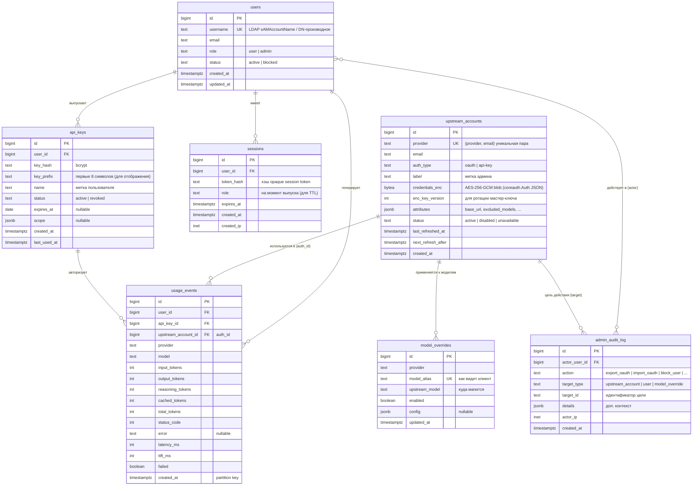

# Схема базы данных CLIProxyNew

> **Статус:** Дизайн (основа для миграций и sqlc).
> **Стек:** Postgres + `pgx/v5` + `sqlc` + `golang-migrate`.
> **Связанные:** [requirements.md](requirements.md) (R5), [ADR-9](adr/ADR-9-sdk-contracts.md).

## Принципы

- **Postgres — единственное состояние сервиса** (R6.1). Все сущности здесь.
- **sqlc генерирует Go-код из SQL** — `*.sql` запросы рядом с пакетами `internal/store/*`, код не правится руками.
- **Партиционирование по дню** для высоконагруженных таблиц событий (analytics).
- **Шифрование at-rest** (R5): upstream-credentials и LDAP bind — как зашифрованный blob (AES-256-GCM с key-version). API-keys — bcrypt-хэш (односторонний).
- **Мягкое удаление** не используется; удаление = физическое (кроме аналитики — TTL/partition drop).
- **Имена таблиц** — snake_case, единственное число. **PK** — `id bigint generated always as identity`.

## ER-диаграмма (основные сущности)

## Таблицы — детали

### `users` (R1.4)
| Поле | Тип | Назначение |
|------|-----|-----------|
| `id` | bigint identity PK | |
| `username` | text, unique, not null | LDAP-derived (sAMAccountName или DN) |
| `email` | text | из LDAP |
| `role` | text, not null | `user` \| `admin` — **не из БД**, пересчитывается live из LDAP-групп при каждом логине (R1). Хранится как snapshot для UI/аналитики, но **не как источник истины для доступа**. |
| `status` | text, not null, default `active` | `active` \| `blocked` (R9.A.3). Блокировка → login/API-key запрещены. |
| `created_at`, `updated_at` | timestamptz | |

**Создание:** provisioning при первом успешном логине (после проверки LDAP-групп). Обновление `role`/`email` — при каждом логине из LDAP.

### `api_keys` (R2, R9.U.2)
| Поле | Тип | Назначение |
|------|-----|-----------|
| `id` | bigint identity PK | |
| `user_id` | bigint FK → users(id), not null | |
| `key_hash` | text, not null | bcrypt-хэш (cost 12) полного API-key |
| `key_prefix` | text, not null | первые 8 символов (для отображения в списке без раскрытия) |
| `name` | text | метка пользователя (напр. "prod laptop") |
| `status` | text, not null, default `active` | `active` \| `revoked` |
| `expires_at` | date, nullable | опц. срок (R2.3) |
| `scope` | jsonb, nullable | опц. ограничения (R2.3) |
| `last_used_at` | timestamptz, nullable | обновляется при auth (best-effort, не на каждый запрос — batch) |

**Уникальность:** по `(user_id, key_prefix)` нет; поиск при auth — по `key_prefix` затем bcrypt-verify. Индекс на `key_prefix`.

### `sessions` (R1.2)
| Поле | Тип | Назначение |
|------|-----|-----------|
| `id` | bigint identity PK | |
| `user_id` | bigint FK → users(id), not null | |
| `token_hash` | text, unique, not null | SHA-256 от opaque token |
| `role` | text, not null | `user` \| `admin` — фиксируется при выпуске для TTL |
| `expires_at` | timestamptz, not null | created + 5мин/10ч |
| `created_ip` | inet, nullable | аудит |

**Токен:** opaque random (напр. 32 байта base64url). В БД — SHA-256. Cookie = `token`. Lookup → hash → SELECT.
**Очистка:** фоновая job (leader) удаляет `expires_at < now()`.

### `upstream_accounts` (R5, ADR-9 Store)
Это Postgres-имплементация `coreauth.Store`. Каждая строка — один `coreauth.Auth`.

| Поле | Тип | Назначение |
|------|-----|-----------|
| `id` | bigint identity PK | **но `coreauth.Auth.ID` — строка** → хранить как text PK или маппинг. Решение: `id text PK` = Auth.ID (ядро управляет ID). |
| `provider` | text, not null | |
| `email` | text, not null | для dedup (R9.A.7) |
| `auth_type` | text, not null | `oauth` \| `api-key` |
| `label` | text | метка админа |
| `credentials_enc` | bytea, not null | AES-256-GCM encrypted `coreauth.Auth` JSON (Storage + Metadata) |
| `enc_key_version` | int, not null | версия мастер-ключа (R5 ротация) |
| `attributes` | jsonb | `base_url`, `excluded_models`, `compat_name`, ... (R10.3, ADR-9) |
| `status` | text, not null | `active` \| `disabled` \| `unavailable` |
| `last_refreshed_at` | timestamptz, nullable | обновляется ядром через Store.Save |
| `next_refresh_after` | timestamptz, nullable | для min-heap ядра |
| `created_at` | timestamptz | |

**Уникальность:** `(provider, email)` — для dedup при импорте (R9.A.7).
**Шифрование:** при Save/Load — бизнес-слой шифрует/расшифровывает blob (AES-GCM). Ядро видит уже расшифрованный `*Auth`.

⚠️ **Нюанс:** `coreauth.Auth.ID` — string (управляется ядром). Хранить `id text PK`, генерируемый ядром при Login/импорте. Бизнес-слой не генерирует ID.

### `model_overrides` (R9.A.6)
Allow-list + model-mapping, хранимые админом.

| Поле | Тип | Назначение |
|------|-----|-----------|
| `id` | bigint identity PK | |
| `provider` | text, not null | |
| `model_alias` | text, not null, unique | как клиент видит (напр. "gpt-4") |
| `upstream_model` | text, not null | реальный upstream-model |
| `enabled` | boolean, not null, default true | |
| `config` | jsonb, nullable | доп. настройки |

**Применение:** в `Selector.Pick` и в access к реестру моделей. Если `model_overrides` пуст → все модели ядра разрешены.

### `usage_events` (R3) — партиционированная
Высоконагруженная: одна строка на upstream-запрос.

| Поле | Тип | Назначение |
|------|-----|-----------|
| `id` | bigint identity PK | (внутри partition) |
| `user_id` | bigint FK | |
| `api_key_id` | bigint FK | |
| `upstream_account_id` | text FK → upstream_accounts(id) | = `usage.Record.AuthID` |
| `provider` | text | |
| `model` | text | |
| `input_tokens`, `output_tokens`, `reasoning_tokens`, `cached_tokens`, `total_tokens` | int | из `Record.Detail` |
| `status_code` | int | из `Record.Failure.StatusCode` или 200 |
| `error` | text, nullable | из `Record.Failure.Body` (обрезанный) |
| `latency_ms` | int | из `Record.Latency` |
| `ttft_ms` | int | из `Record.TTFT` |
| `failed` | boolean | из `Record.Failed` |
| `created_at` | timestamptz, not null | **partition key** |

**Партиционирование:** `PARTITION BY RANGE (created_at)`, партиции по дню.
**Retention:** фоновая job (leader) удаляет партиции старше N дней (TBD — открытый пункт R3).
**Индексы:** на `(user_id, created_at)`, `(provider, created_at)`, `(model, created_at)`.

### `usage_aggregates` (R3.2) — материализованные агрегаты
Предварительно вычисленные агрегаты для дашбордов/API.

| Поле | Тип |
|------|-----|
| `period_start` | date PK |
| `dimension` | text PK | `user` \| `model` \| `provider` \| `api_key` |
| `dimension_value` | text PK |
| `request_count` | bigint |
| `input_tokens_sum` | bigint |
| `output_tokens_sum` | bigint |
| `total_tokens_sum` | bigint |
| `failure_count` | bigint |

**Обновление:** `REFRESH MATERIALIZED VIEW CONCURRENTLY` по расписанию (leader), напр. каждые 15 мин, + инкрементальная day-rollup job.

### `admin_audit_log` (R9.G)
| Поле | Тип | Назначение |
|------|-----|-----------|
| `id` | bigint identity PK | |
| `actor_user_id` | bigint FK → users(id) | |
| `action` | text, not null | enum: `login` (admin), `block_user`, `unblock_user`, `provider_oauth_setup`, `provider_apikey_add`, `model_override_change`, `oauth_export`, `oauth_import`, ... |
| `target_type` | text | `upstream_account` \| `user` \| `model_override` |
| `target_id` | text | |
| `details` | jsonb | доп. контекст |
| `actor_ip` | inet | |
| `created_at` | timestamptz | partition by month (опц.) |

**Append-only.** Не обновляется/не удаляется (compliance).

## Индексы — сводка

| Таблица | Индекс | Назначение |
|---------|--------|-----------|
| `api_keys` | `(key_prefix)` | lookup при auth |
| `sessions` | `(token_hash)` unique | session lookup |
| `sessions` | `(user_id)` | инвалидиация при block |
| `upstream_accounts` | `(provider, email)` unique | dedup при импорте |
| `upstream_accounts` | `(status)` | фильтр активных |
| `usage_events` | `(user_id, created_at desc)` | личная статистика |
| `usage_events` | `(provider, created_at desc)` | агрегация по провайдеру |
| `usage_events` | `(model, created_at desc)` | агрегация по модели |
| `admin_audit_log` | `(actor_user_id, created_at desc)` | аудит по админу |
| `admin_audit_log` | `(target_type, target_id)` | аудит по цели |

## Миграции (порядок)

В `db/migrations/`, нейминг `YYYYMMDDHHMMSS_<name>.up.sql` + `.down.sql`:

1. `000001_init_users_api_keys_sessions.up.sql` — users, api_keys, sessions + индексы
2. `000002_upstream_accounts.up.sql` — upstream_accounts (Store) + индексы
3. `000003_model_overrides.up.sql` — model_overrides
4. `000004_usage_events_partitions.up.sql` — родитель + initial partition + aggregation view
5. `000005_admin_audit_log.up.sql` — admin_audit_log

**Partition management** — отдельная SQL-функция + cron-job (leader) для создания будущих партиций и удаления старых.

## Открытые вопросы (детализация)

- TTL ретенции `usage_events` (TBD — открытый пункт R3).
- Формат `scope` в `api_keys` (jsonb структура — определится в R9 дизайне API).
- Глубина аудит-лога: партиционировать `admin_audit_log` по месяцам или оставить единой таблицей.
