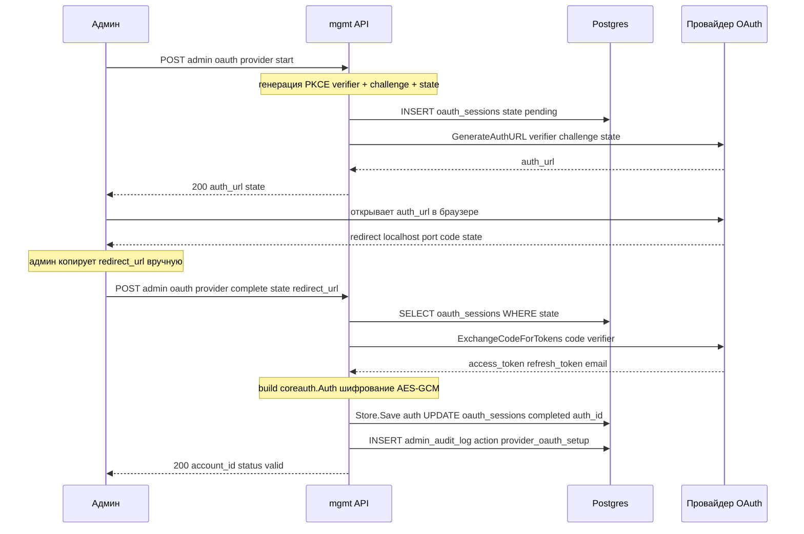
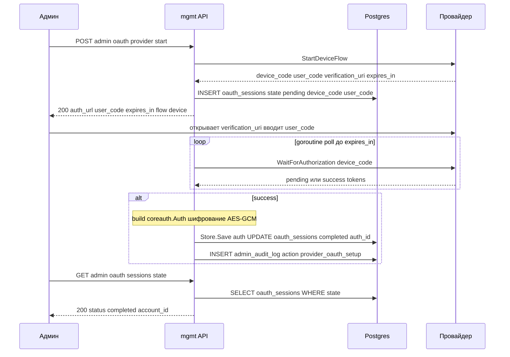
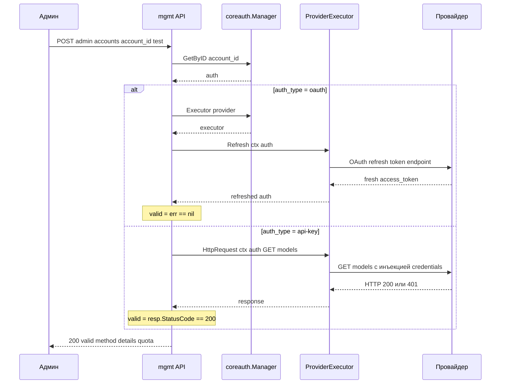

# Дизайн: R9.A.1 (OAuth login-flow) и R9.A.5 (тестирование аккаунтов)

> **Статус:** Дизайн.
> **Связанные:** [requirements.md](../requirements.md) R9.A.1, R9.A.5;
> [sdk-reference.md](../sdk-reference.md); [ADR-9](../adr/ADR-9-sdk-contracts.md).

## Контекст: почему `sdkAuth.Manager.Login` не подходит

`sdkAuth.Manager.Login()` — **блокирующий синхронный** вызов:
- URL печатается в stdout (`fmt.Printf`) — не возвращается в Go-код;
- callback ловится локальным HTTP-сервером на `CallbackPort` (Codex 1455, Claude 54545, Antigravity 51121);
- `LoginOptions.Prompt` — CLI-fallback, срабатывает через 15с ожидания;
- недоступен извне для перехвата URL.

→ **Не годится для management-API.** Но ядро содержит низкоуровневые сервисы
(`claude.NewClaudeAuth`, `codex.NewCodexAuth`, `kimi.NewKimiAuth`,
`xaiauth.NewXAIAuth`, `antigravity.NewAntigravityAuth`) и хелперы
(`sdk/api/management.go`: `RegisterOAuthSession`,
`WriteOAuthCallbackFileForPendingSession`, `ValidateOAuthState`,
`NormalizeOAuthProvider`), на которых можно построить асинхронный flow.

Ядро уже имеет асинхронные management-handlers (`/v0/management/*-auth-url`),
но их OAuth-сессии — **in-memory в одной реплике**. В multi-replica (R6.2)
replica A стартует flow, replica B не может завершить. Поэтому бизнес-слой
реализует свою версию с **Postgres-хранилищем сессий**.

---

## R9.A.1 — OAuth login-flow

### Два режима по провайдеру

| Провайдер | Flow | Callback-сервер | API-flow |
|-----------|------|-----------------|----------|
| **Codex** | PKCE (порт 1455) или device (`Metadata`) | да (PKCE) / нет (device) | callback или device |
| **Claude** | PKCE (порт 54545) | да | callback |
| **Antigravity** | PKCE (порт 51121) | да | callback |
| **Kimi** | device-code | нет | device |
| **xAI (Grok)** | device-code | нет | device |

### API-flow: callback-провайдеры (Codex PKCE, Claude, Antigravity)



⚠️ **redirect_uri вшит у провайдера** в `localhost:<CallbackPort>`. На первой
версии — ручной copy-paste redirect_url админом (не требуется exposed-port в
k8s). В будущем — опциональный callback-forwarder на CallbackPort для
автоматического перехвата (режим `is_webui`).

### API-flow: device-провайдеры (Kimi, xAI, Codex-device)



### Эндпоинты

| Метод | Путь | Назначение |
|-------|------|-----------|
| `POST` | `/api/v1/admin/oauth/{provider}/start` | Запуск flow (PKCE или device) |
| `POST` | `/api/v1/admin/oauth/{provider}/complete` | Завершение callback-flow (`{state, redirect_url}`) |
| `GET` | `/api/v1/admin/oauth/sessions/{state}` | Статус (`{status, account_id?, error?}`) |
| `GET` | `/api/v1/admin/oauth/sessions` | Список активных (admin overview) |
| `DELETE` | `/api/v1/admin/oauth/sessions/{state}` | Отмена flow |

### Component: `internal/auth/oauth`

```go
// internal/auth/oauth/manager.go
type FlowManager struct {
    db          *pgxpool.Pool
    providers   map[string]ProviderFlow  // per-provider низкоуровневые сервисы
    audit       AuditLogger
}

type ProviderFlow interface {
    StartCallback(ctx context.Context) (authURL, state, verifier string, err error)
    StartDevice(ctx context.Context) (authURL, userCode, deviceCode string, expiresIn time.Duration, err error)
    CompleteCallback(ctx context.Context, redirectURL, verifier string) (*coreauth.Auth, error)
    PollDevice(ctx context.Context, deviceCode string) (*coreauth.Auth, error)
}

// Start → создаёт oauth_sessions row, возвращает response для API.
// CompleteCallback → обмен code → tokens → Store.Save → update session.
// PollDevice (goroutine) → poll провайдера → Store.Save → update session.
```

Реализация `ProviderFlow` per-провайдер — обёртки над `claude.NewClaudeAuth`,
`codex.NewCodexAuth`, и т.д. (без блокирующего `Login`).

### Multi-replica

- **Сессии в Postgres** → любая реплика может `Complete` (update status where pending — идемпотентно).
- **Device-polling goroutine** живёт на реплике, стартовавшей flow. При падении реплики — session остаётся `pending` до `expires_at`, cleanup-джоба (leader) закрывает. При желании можно перезапустить polling через management-API.
- **Cleanup (leader):** удаляет `expires_at < now()` и терминальные статусы старше 1 часа.

---

## R9.A.5 — Тестирование валидности upstream-аккаунта

### Механизм по типу креды

| Тип креды | Механизм | Тратит квоту? | Что проверяет |
|-----------|----------|---------------|---------------|
| **OAuth** (Codex/Claude/Antigravity) | `executor.Refresh(ctx, auth)` | ❌ нет | `refresh_token` жив, получен свежий access_token |
| **API-key** (Gemini-key/Claude-key/OpenAI-compat) | `executor.HttpRequest(ctx, auth, GET /models)` | ❌ нет | ключ валиден по HTTP 200 |
| **(не используется)** | `Execute`/`CountTokens` | ✅ да | inference — не для health-check |
| **(доп. контекст)** | `Auth.Status`/`LastError`/`Quota` | ❌ нет | stale-кэш последнего запроса |

### Per-provider metadata-endpoints для API-key health-check

| Провайдер | Endpoint | Валиден если |
|-----------|----------|-------------|
| Claude (Anthropic) | `GET https://api.anthropic.com/v1/models` (+ `anthropic-version` header) | HTTP 200 |
| Codex (ChatGPT) | `GET https://chatgpt.com/backend-api/me` | HTTP 200 |
| Gemini (Google) | `GET https://generativelanguage.googleapis.com/v1beta/models?key=KEY` | HTTP 200 |
| OpenAI-compat | `GET {base_url}/models` | HTTP 200 |

⚠️ **Для Antigravity** Refresh уже обновляет `AntigravityCreditsHint` (через
`loadCodeAssist`) → бонусом актуальный баланс для R9.A.4.

### API-flow



### Эндпоинт

| Метод | Путь | Назначение |
|-------|------|-----------|
| `POST` | `/api/v1/admin/accounts/{account_id}/test` | Проверка валидности |

### Ответ

```json
{
  "valid": true,
  "method": "refresh",
  "details": {
    "status_code": 200,
    "expires_at": "2026-07-12T15:30:00Z",
    "last_refreshed_at": "2026-07-12T14:00:00Z"
  },
  "quota": {
    "exceeded": false,
    "reason": ""
  }
}
```

`method`: `"refresh"` (OAuth) | `"http_probe"` (API-key). `quota` — из
`auth.Quota` (реактивная, из последнего inference-запроса) или
`AntigravityCreditsHint` для Antigravity.

### Component: `internal/auth/testing`

```go
// internal/auth/testing/checker.go
type Checker struct {
    manager *coreauth.Manager
}

type TestResult struct {
    Valid       bool
    Method      string  // "refresh" | "http_probe"
    StatusCode  int
    ExpiresAt   time.Time
    Quota       QuotaInfo
    Error       string
}

func (c *Checker) Test(ctx context.Context, accountID string) (TestResult, error) {
    auth, ok := c.manager.GetByID(accountID)
    executor, ok := c.manager.Executor(auth.Provider)
    if auth.AuthKind() == coreauth.AuthKindOAuth {
        return c.testViaRefresh(ctx, executor, auth)
    }
    return c.testViaHttpProbe(ctx, executor, auth)
}
```

`testViaRefresh` вызывает `executor.Refresh`, `testViaHttpProbe` строит
`*http.Request` к per-provider endpoint и вызывает `executor.HttpRequest`.

---

## Открытые вопросы (после дизайна)

- **R9.A.1:** список CallbackPort per provider в конфиге (для опционального
  callback-forwarder в будущем). На первой версии — hardcoded defaults.
- **R9.A.1:** что делать при падении реплики в device-polling — cleanup
  по `expires_at` достаточно, или добавить re-poll endpoint.
- **R9.A.5:** per-provider metadata-endpoint'ы могут меняться (провайдер
  меняет API) — вынести в конфиг `health_check.endpoints` для гибкости.
- **R9.A.5:** Antigravity — `AntigravityCreditsHint` из `Refresh` уже даёт
  квоту; для остальных провайдеров R9.A.4 остаётся реактивной.
