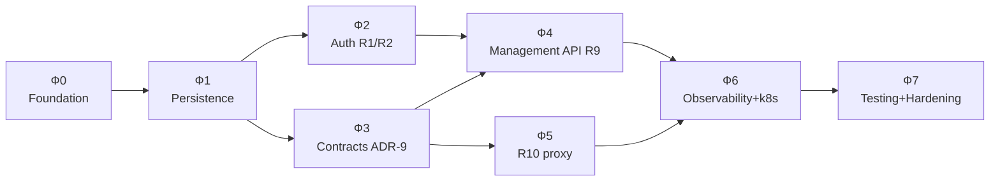

# План имплементации CLIProxyNew по фазам

> **Статус:** Принят.
> **Текущий scope:** бизнес-слой R1–R12 и автоматизированный release hardening.
> Provider-specific OAuth flows не реализуются до появления подходящего
> публичного SDK-контракта; load/chaos и operational runbooks остаются следующим
> release-operations инкрементом.
> **Связанные:** [requirements.md](requirements.md), [architecture-principles.md](architecture-principles.md),
> [architecture.md](architecture.md), [database-schema.md](database-schema.md).

## Принципы разбиения

- **Снизу вверх**: foundation → persistence → auth → contracts → features → hardening.
- Каждая фаза — **вертикальный срез** с проверяемым deliverable и acceptance criteria.
- Фазы с зависимостями идут последовательно; независимые — параллелятся.
- Каждая фаза завершается коммитом/merge с зелёным CI (tests + vet + build).

## Граф зависимостей

## Оценки

При одном разработчике ~16–19 недель; при команде 2–3 (с учётом
parallelizable Ф2/Ф3 и Ф4/Ф5) — ~8–10 недель. Оценки предварительные,
пересматриваются по итогам каждой фазы.

---

## Фаза 0 — Foundation
**Цель:** компилируемый проект с подключённым ядром, скелетом пакетов, CI.

- [x] Подключить ядро `github.com/router-for-me/CLIProxyAPI/v7` в `go.mod` (проверить, что реально резолвится)
- [x] Создать скелет пакетов `internal/{config,security,store,access,auth/{ldap,selector,oauth,testing},cache,httpapi,modelregistry,usage,watcher}` (пустые `doc.go` с godoc)
- [x] `internal/config` (R6) — структура `Config`, парсинг config.yaml, env-override (12-factor), config.example.yaml
- [x] `cmd/cliproxy/main.go` — runtime wiring config → Postgres → Store →
  Builder → `Service.Run` с public SDK contracts
- [x] CI pipeline (GitHub Actions): `go vet`, `gofmt -l`, `go build`,
  `go test -short -race`, Spectral и SDK compatibility gate
- [x] OpenAPI generator spike: выбран `ogen` v1.23.0; OAS 3.1 compatibility
  projection и typed bindings генерируются и проверяются на drift в CI (ADR-11)
- [x] Базовый `openapi.yaml` (OpenAPI 3.1) + spectral lint в CI
- [x] R12: SDK compatibility gate — `internal/sdkcontract` компилирует все
  публичные extension points ADR-9, CI запускает его отдельно; `go mod tidy`
  проверяет согласованность `go.mod`/`go.sum`

**Acceptance:** `go build ./...` зелёный, ядро в зависимостях, CI проходит на пустых тестах, `openapi.yaml` валидируется.

---

## Фаза 1 — Persistence layer
**Цель:** БД, доступ, шифрование, контракты Store.

- [x] Все миграции (порядок из [database-schema.md](database-schema.md) §«Миграции»):
  1. users, api_keys, sessions
  2. upstream_accounts (Store)
  3. model_overrides
  4. usage_events (родитель + initial partition + usage_aggregates view)
  5. admin_audit_log
  6. oauth_sessions
- [x] Миграция `users.identity_source`: source/namespace CHECK, совместимый
  default `ldap` и guarded down (R1.5)
- [x] sqlc config + сгенерированные запросы для всех таблиц, включая
  admin_audit_log, oauth_sessions, model_registry_snapshots и runtime_revisions
- [x] Отдельный cron/scheduler для `usage_events` не требуется и не планируется;
  существующая схема и миграции этим инкрементом не меняются
- [x] `internal/security` — bcrypt cost 12 + AES-256-GCM с key-version prefix (R5)
- [x] `internal/store` — repositories для users, api_keys, sessions,
  model_overrides, usage_events, runtime_revisions, admin_audit_log,
  oauth_sessions и model_registry_snapshots
- [x] `internal/store` — реализация `coreauth.Store` (List/Save/Delete) с transparent AES-шифрованием credentials
- [x] Integration tests с testcontainers PG (миграции up/down идемпотентны)

**Acceptance:** все миграции накатываются/откатываются, sqlc генерирует код, Store проходит контрактные тесты (encrypt → save → load → decrypt = исходный Auth).

---

## Фаза 2 — Auth (R1, R2)
**Цель:** login через identity source, session-cookie, API-keys, access.Provider.

- [x] `internal/auth/ldap` (R1) — bind (service-account из env), search user DN, user-bind, проверка групп (admin-group, user-group из config), логика роли (admin → admin; иначе user → user; иначе 403)
- [x] `internal/auth/identity` — `IdentityProvider` и static provider: только
  `auth.mode=static` + `server.environment=development|test`, credentials из
  env, namespace `static:<username>`; LDAP не является fallback
- [x] `internal/auth/ldap` — provisioning users при первом логине, проверка `users.status`
- [x] Session lifecycle: генерация opaque token, INSERT sessions (token_hash SHA-256, role, expires_at = TTL user=5м/admin=10ч), Set-Cookie (HttpOnly, Secure, SameSite)
- [x] `internal/access` (R2) — lookup api_keys по prefix → bcrypt verify →
  check users.status → versioned Principal с user_id/api_key_id для analytics
- [x] `access.RegisterProvider("db-apikey", ...)` + `access.SetExclusiveProvider("db-apikey")`
- [x] `internal/cache` — generic TTL, api_key_lookup и session_lookup готовы;
  session cache использует TTL 10с, локально invalidates на admin block/logout,
  а межрепличная согласованность ограничена TTL
- [x] Unit tests: LDAP через fake connection, access cache hit/miss и blocked
  user, фиксированные user/admin session TTL и cache invalidation
- [x] Regression tests: static запрещён в production; source isolation для
  session/API-key подтверждён на Postgres; guarded migration down отказывает
  при static users. Non-rolling switch зафиксирован в deployment runbook.

**Acceptance текущего scope:** login создаёт cookie с фиксированным TTL, запрос
с API-key авторизуется, заблокированный пользователь отвергается, cache
hit/miss и invalidation покрыты тестами. SLA hit ratio проверяется будущим
load-gate Ф7.

---

## Фаза 3 — Core contracts ADR-9
**Цель:** 7 контрактов расширения ядра, wiring, запуск сервиса.

- [x] `sdkAuth.RegisterTokenStore(store)` вызывается ДО Builder (в `main.go`)
- [x] `internal/auth/selector` — fail-closed TTL-кэш (5с) allow-list, provider
  filter и fill-first готовы. `upstream_model` хранится как desired mapping;
  runtime rewrite заблокирован до публичного SDK hook (R12 запрещает обход через
  `internal/*`).
- [x] `internal/usage` — Plugin декодирует versioned `record.APIKey`; bounded
  очередь (1024) пишет batch до 100 событий через `pgx.Batch` каждые 250мс и
  flush'ится при shutdown. После успешного batch обновляет уникальные
  `api_keys.last_used_at` не чаще раза в минуту.
- [x] `internal/usage` — `coreauth.Hook` подключён к `coreauth.Manager` и
  потокобезопасно считает lifecycle credentials и успешные/неуспешные
  upstream-результаты без payload/credentials; Prometheus export — Ф6.
- [x] `internal/watcher` — SDK file watcher заменён public no-op factory;
  DB revision poller делает controlled restart после transactionally increased
  revision в Store.Save/Delete. Advisory leader на отдельном Postgres connection
  запускает cleanup истёкших sessions; integration test проверяет lock handoff.
  Прямой DB-push `AuthUpdate` ждёт публичный SDK тип (R12).
- [x] `internal/modelregistry` — `ModelRegistryHook`: через публичный
  `cliproxy.SetGlobalModelRegistryHook` зеркалирует полный JSON snapshot в
  Postgres по `(provider, client_id)`; регистрация заменяет snapshot, снятие
  регистрации удаляет его. Локальная схема не зависит от полей `ModelInfo`.
- [x] `cmd/cliproxy/main.go` — доступный runtime wiring: config bridge → db →
  security → Store → RegisterTokenStore → coreManager → Builder → login router
  → RegisterUsagePlugin → Service.Run
- [x] `internal/config` — минимальный SDK config bridge для listener; file-backed
  auth/watcher намеренно не bridge'ится, источник credentials — Postgres Store
- [x] Compile-contracts публичных extension points в `internal/sdkcontract` и
  явный behavioral gate `scripts/verify-adr9-contracts.sh` для всех семи ролей
  ADR-9, включая PostgreSQL `coreauth.Store`

**Acceptance:** сервис запускается и проксирует inference-запрос (с тестовым auth), auto-refresh работает (mock провайдера), usage_events записываются, leader election переключается при падении реплики (multi-instance тест).

---

## Фаза 4 — Management API (R9)
**Цель:** полный management-API, OpenAPI-first.

- [x] `openapi.yaml` — management-эндпоинты и полный proxy HTTP surface SDK
  v7.2.80 (27 method/path operations для `/v1`, `/openai/v1`,
  `/backend-api/codex`, `/v1beta`) описаны без дублирования upstream body-схем;
  route matrix защищена embedded contract test. Опциональный `/docs` остаётся Ф6
- [x] Генерация typed bindings из `openapi.yaml`: `ogen` v1.23.0 через
  compatibility projection (ADR-11); контракт покрывает lifecycle management-сессии
  (`/api/v1/me`, `/api/v1/logout`); adapter существующих handlers — отдельный шаг
- [x] `internal/httpapi` — management routes через `api.WithRouterConfigurator`:
  - [x] `/api/v1/login`, `/api/v1/logout`, `/api/v1/me` (R1, session-cookie middleware)
  - [x] `/api/v1/me/keys` CRUD (R9.U.2; create/list/revoke)
  - [x] `/api/v1/me/usage` (R9.U.3; totals, модели и API-ключи за период)
  - [x] `/api/v1/admin/users`, `/api/v1/admin/keys` (R9.A.3; users list/status + all-keys)
- **Вне текущего scope / SDK-blocked:** provider-specific R9.A.1 callback/device
  OAuth flows. PostgreSQL lifecycle и typed admin list/get/cancel готовы, но
  public SDK v7.2.80 не предоставляет async flow с внешним session store;
  импорт upstream `internal/*` запрещён R12
- [x] R9.A.5 testing: `internal/auth/testing` (Checker) — OAuth через
  `Refresh` с persistence обновлённого Auth, API-key через `HttpRequest` к
  provider metadata endpoint; `POST /api/v1/admin/accounts/{accountID}/test`
  не вызывает inference/CountTokens
- [x] R9.A.2 batch API-keys провайдеров: `POST /api/v1/admin/providers/keys`
  регистрирует до 100 credentials через public `coreauth.Manager.Register`,
  шифрует их в Store и пишет audit в той же транзакции; ответ не содержит ключей
- [x] R9.A.4 просмотр квоты: `GET /api/v1/admin/accounts/{accountID}/quota`
  возвращает `Auth.Quota`, expiry и `AntigravityCreditsHint`; `unknown=true`
  явно обозначает отсутствие реактивных runtime-данных, без inference-вызова
- [x] R9.A.6 allow-list моделей + provider selection (через model_overrides;
  admin read/upsert/delete с audit, OpenAPI и HTTP tests). `upstream_model`
  хранится как desired mapping до публичного SDK hook для downstream rewrite.
- [x] R9.A.7 export/import OAuth JSON: export attachment с audit; import с
  лимитом тела, проверкой OAuth/email, dedup `provider+email`, SDK-managed ID
  и транзакционным audit при Store.Save
- [x] `admin_audit_log` writing на все mutating admin-действия: статус
  пользователя, upstream credentials, model overrides и отмена OAuth-сессий;
  транзакционные integration tests подтверждают domain state и audit record
- [x] Middleware: session-cookie auth, role-guard, request ID и CORS готовы;
  CORS ограничен явным allow-list `server.cors_allowed_origins` и применяется
  только к management-маршрутам `/api/v1`.
- [x] Functional tests (HTTP end-to-end) для всех реализованных management-
  эндпоинтов: router → session-cookie → role guard, login/logout, user API-keys
  и usage, admin users/keys, provider keys/models, OAuth sessions/import/export,
  account test/quota

**Acceptance текущего scope:** реализованные R9-функции работают через REST,
OpenAPI спецификация валидируется, drift-check с кодом проходит,
`admin_audit_log` покрывает mutating actions. Provider OAuth flows не являются
блокером этого инкремента.

---

## Фаза 5 — System proxy (R10)
**Цель:** единая outbound proxy policy через стандартное окружение процесса.

- [x] Удалены `proxy.*` из `config.yaml` и `CLIPROXY_PROXY_*` overrides
- [x] `CoreAuthStore` очищает legacy `Auth.ProxyURL` при Load/Save
- [x] Inference, refresh, quota и models делегируют proxy policy публичному SDK
  и `http.ProxyFromEnvironment` (`HTTP_PROXY`, `HTTPS_PROXY`, `NO_PROXY`)
- [x] Документация и example config переведены на system proxy; credentials
  proxy не логируются и не сохраняются в БД

**Acceptance:** все HTTP-клиенты используют одинаковую system proxy policy,
`NO_PROXY` задает исключения, а credentials не содержат `Auth.ProxyURL`.

---

## Фаза 6 — Observability + Deployment (R6)
**Цель:** prod-ready: k8s, metrics, traces, health, OpenAPI-serving.

- [x] Prometheus `/metrics`: isolated registry, HTTP request count/latency,
  upstream result/lifecycle counters, pgx pool stats и usage queue depth
- [x] Prometheus cache hit/miss: `cliproxy_cache_lookups_total` экспортирует
  snapshot candidate cache клиентских API-keys с outcome `hit|miss`
- [ ] Prometheus: специализированные refresh success/failure
  после появления соответствующих business hooks
- [x] OpenTelemetry traces: HTTP server span и trace-context propagation,
  вложенные spans для `access.Provider` и `Selector` с безопасными атрибутами
- [ ] OpenTelemetry: вложенный span для SDK Execute после появления подходящей
  публичной точки расширения без импорта upstream `internal/*`
- [x] Structured request logging: middleware пишет только method, route template,
  status, duration, request ID и principal без headers, query или body
- [x] `slog` structured JSON + redaction: глобальный handler скрывает attrs с
  password/secret/token/credential/authorization/API-key, включая группы и
  `WithAttrs`; структурирование ошибок расширяется отдельными инкрементами
- [x] `/healthz` (liveness) и `/readyz` (readiness = PostgreSQL `Ping` с
  timeout); системный configurator не пропускает probes через management auth
  и не раскрывает ошибку БД в ответе
- [x] `/openapi.json`: встроенный JSON генерируется из `openapi.yaml` через
  `go generate ./internal/openapi`; CI пересоздаёт документ и проверяет drift
- [ ] `/docs` (опц. Swagger UI / Redoc)
- [x] Dockerfile (multi-stage: build → distroless non-root runtime)
- [x] k8s manifests: Deployment (≥2 replicas, HPA), ConfigMap (config.yaml),
  Secret reference (env), Service, Ingress, PDB и probes
- [x] Runbook dev/test: переключение `auth.mode` только через scale-to-zero /
  recreate; production всегда `auth.mode=ldap`
- [x] Graceful shutdown: после завершения `Service.Run` вызывается публичный
  `Service.Shutdown(ctx)` с отдельным timeout 30с для drain in-flight запросов
- [x] Liveness/readiness probes в k8s
- [x] Configuration: config.example.yaml, .env.example, deployment README

**Acceptance:** деплоится в k8s (≥2 replicas), `/metrics` отдаёт метрики, traces идут в Jaeger/Tempo, graceful shutdown работает, `/openapi.json` доступен.

---

## Фаза 7 — Testing & Hardening
**Цель:** автоматизированный release hardening и последующая валидация
операционных SLA перед production v1.

- [ ] Load-тесты по SLA ([architecture-principles.md](architecture-principles.md) §2.1): vegeta/k6 — overhead бизнес-слоя ≤ 5мс p95, cache hit ≥ 95%
- [x] E2E: реальный SDK runtime + PostgreSQL, login → API-key → inference →
  analytics → user/admin operations
- [x] Behavioral contract gate: все 7 контрактов ADR-9 с race-проверками и
  PostgreSQL contract для `coreauth.Store`
- [x] Integration tests: testcontainers PostgreSQL для store, migrations,
  watcher/leader election и persistence-контрактов
- [x] Regression: static identity не проходит в LDAP/prod режиме даже с
  активными session/API-key
- [x] Aggregate coverage report + CI gate ≥ 70% для handwritten `internal/*`
  (generated ogen/sqlc packages исключены; baseline 73.9%)
- [x] Security gate: tracked secret/key/binary scan, private-key markers,
  unstructured runtime printing, sensitive slog patterns и `govulncheck`
- [x] Full race gate: `go test -race -timeout 15m ./...` до build
- [ ] R12: runbook обновления SDK (release notes → upgrade branch →
  `sdk-reference.md` → contract/integration/race gates → rollback version)
- [ ] Documentation: godoc для всех пакетов, README update, runbook (restore backup, rotate AES key, rotate API-key, rotate LDAP bind)
- [ ] Regression suite: SLA-метрики как CI gate (не regress'ить)
- [ ] Chaos: kill leader → проверка failover; kill replica → сервис жив

**Automated hardening acceptance:** E2E, ADR-9 contracts, PostgreSQL
integration, static regression, coverage ≥ 70%, security audit и full race
являются независимыми CI jobs; build зависит от каждого gate.

**Оставшиеся release-operations gates:** load/SLA, chaos/failover и
операционные runbooks. До их закрытия документ не объявляет production v1 ready.

---

## Сводка

| Фаза | Длительность | Зависимости | Deliverable |
|------|--------------|-------------|-------------|
| Ф0 Foundation | 1–2 нед | — | Компилируемый проект + CI |
| Ф1 Persistence | 1–2 нед | Ф0 | БД + Store + шифрование |
| Ф2 Auth | 2 нед | Ф1 | LDAP + session + API-keys |
| Ф3 Contracts ADR-9 | 2 нед | Ф1 | 7 контрактов + запуск |
| Ф4 Management API | 3–4 нед | Ф2, Ф3 | R9 + OpenAPI |
| Ф5 R10 system proxy | 1 нед | Ф3 | Proxy policy через окружение процесса |
| Ф6 Observability + k8s | 2 нед | Ф4, Ф5 | Prod deployment |
| Ф7 Testing + Hardening | 2 нед | Ф6 | Automated gates; release ops pending |
| **Итого** | **~16–19 нед** (1 dev) / **~8–10 нед** (2–3 dev) | | |

## Что НЕ в плане v1 (явные ограничения)

- Квоты и rate-limit (отложено, роль репо)
- Web UI (R9.G — только REST API; UI отдельной итерацией)
- Плагины (используем контракты ADR-9, не plugin host)
- Redis (ADR-8 — Postgres достаточно на v1)
- Fork/patch ядра (ADR-1)
- Поддержка Home-режима ядра (не наш use-case)
- Provider-specific OAuth callback/device flows до появления публичного SDK
  контракта для внешнего session store

## История
- 2026-07-12 — план зафиксирован; scope v1 = всё из R1–R12 (кроме явных «не делаем»).
  Старт с Ф0 Foundation.
- 2026-07-14 — добавлен R1.5: static identity source для development/test,
  миграция identity_source, source isolation и non-rolling переключение mode.
- 2026-07-14 — добавлен R12: compatibility gate и runbook обновления внешнего
  SDK без fork/internal-импортов.
- 2026-07-14 — progress: добавлены model overrides, usage persistence, runtime
  revisions, controlled restart и versioned principal adapter для analytics.
- 2026-07-15 — progress: добавлена batch-регистрация upstream API-keys через
  public SDK Manager с encrypted Store, транзакционным admin audit и OpenAPI.
- 2026-07-15 — progress: добавлена проверка upstream-аккаунтов без inference:
  OAuth refresh и API-key metadata probes через публичный ProviderExecutor.
- 2026-07-15 — progress: добавлен read-only просмотр runtime-квоты upstream
  аккаунта, включая public Antigravity credits hint и явный unknown-state.
- 2026-07-15 — progress: добавлены экспорт и импорт OAuth credential JSON с
  dedup provider/email, аудированием и назначением ID public SDK Manager.
- 2026-07-15 — progress: добавлен безопасный request ID middleware для всех
  HTTP-маршрутов через публичный `sdkapi.WithMiddleware`.
- 2026-07-15 — progress: добавлен CORS для browser management API с явным
  allow-list origin, credential-cookie support и корректным preflight.
- 2026-07-15 — progress: начато сквозное HTTP-покрытие management router:
  session-cookie и role guard проверены для anonymous, user и admin запросов.
- 2026-07-15 — superseded: конфигурационная часть R10 с per-call-type proxy
  URL заменена system proxy policy.
- 2026-07-15 — change: R10 переделан на system proxy: удалены per-call-type
  настройки, `Auth.ProxyURL` очищается, используются HTTP_PROXY/HTTPS_PROXY/NO_PROXY.
- 2026-07-15 — progress: сквозное HTTP-покрытие management расширено на
  user API-key read/revoke и admin user-status mutation через session-cookie.
- 2026-07-16 — progress: graceful shutdown вызывает публичный SDK
  `Service.Shutdown` с отдельным лимитом 30с; lifecycle helper покрыт unit-тестами.
- 2026-07-16 — progress: добавлены проверяемый multi-stage Dockerfile и k8s
  baseline (Deployment/HPA/PDB/ConfigMap/Service/Ingress/probes), .env.example
  и runbook rollout; Secret остаётся операционным ресурсом вне Git.
- 2026-07-16 — progress: session lookup cache включён в runtime с TTL 10с;
  admin status mutation и logout немедленно инвалидируют local entries,
  межрепличная согласованность остаётся bounded TTL без Redis.
- 2026-07-16 — progress: добавлен PostgreSQL regression для guarded rollback
  identity_source migration при static user; static/prod и source-isolation
  проверки сведены в закрытый security regression набор Ф2.
- 2026-07-16 — progress: OpenAPI пополнен основными proxy compatibility URLs
  с Bearer API-key и общими errors без дублирования upstream payload schemas;
  embedded JSON и ogen bindings пересозданы.
- 2026-07-16 — progress: добавлены дочерние OpenTelemetry spans для
  `access.Provider` и `Selector` с trace-context propagation, error status и
  тестами, запрещающими попадание API-key, credential metadata и boundary-error
  messages в attributes, status description и span events.
- 2026-07-16 — dependency refresh: Go 1.26.5, CLIProxyAPI v7.2.80, ogen
  v1.23.0, Gin v1.12.0, pgx v5.10.0, testcontainers v0.43.0, OTel 1.44;
  CI actions обновлены до v7, public SDK diff задокументирован.
- 2026-07-16 — hardening: OpenAPI синхронизирован с 27 proxy operations SDK,
  добавлены behavioral ADR-9 gate, runtime E2E, aggregate coverage 70%, source
  security audit, PostgreSQL integration и full-race CI jobs перед build;
  OAuth provider flows и release-operations gates вынесены из текущего scope.
